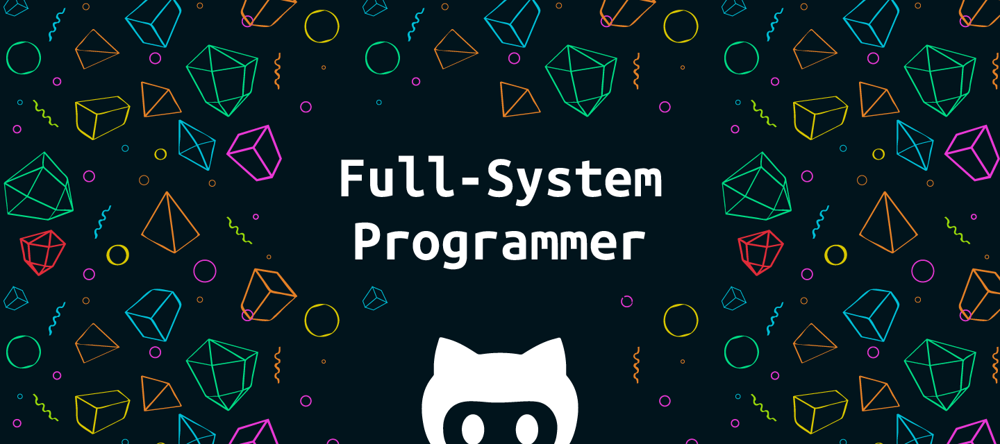

  

    
  

  

  <h1>Hi 👋🏻, I'm Hossein Mojadami</h1>
  
A professional system level programmer from Iran

\
**Full-System Programmer & Digital Craftsman**\
\
I am obsessed with the fundamental art of creation.\
My passion lies in building complex systems from the ground up,\
with a deep reverence for performance, elegance, and control.\
\
I DON'T JUST USE TOOLS!\
\* I understand, reinvent, and build them.

---

  
<b>What I Enjoy :)</b>

I find joy in creating the very ground upon which software is built. 
 
I have a deep affinity for C! 
- manual memory management 
- and squeezing the most out of hardware. 
Writing clean, fast, and highly maintainable code is a core tenet of my work. 
 
I possess a strong sense of UI/UX design, 
believing that powerful software must also be intuitive and a pleasure to use. 

---

  
<b>What Am Picky About :\</b>

&nbsp; I have a low tolerance for the overhead and abstraction of modern framework churn. 
&nbsp; I often prefer the clarity and control of a bespoke solution over the convenience of a bloated dependency.

---

  
<b>My drive is simple:</b>

&nbsp; to understand, to build, and to optimize. 
&nbsp; I am always seeking the perfect balance between raw performance and sublime user experience.

## **Languages**

## *Vision* 🎯
I’m driven by a **dream** to become a *world-class programmer*!\
not just to grow *professionally* but to build a meaningful **future** with someone who **inspires me**. 🌍

  

  <h1>🌍 <i>About Me</i></h1>
  
Multilingual Connector

  <pre style="max-width: 60em; text-align: left; display: inline-block;">
Beyond the code, I have a natural talent for connecting with people and building lasting friendships. 
I speak English, Arabic, and Farsi, and I love making new connections and meeting good people. 
My greatest joy comes from building real, genuine relationships and helping others grow. I love teaching, sharing knowledge, and supporting people to reach their best version and find happiness. I'm known for being a kind and positive person, and I cherish the deep friendships I've made along the way. 
I believe in helping generously, while also maintaining the focus needed to bring my own visions to life.</pre>
  

  <h1><b>Let’s Create Something Amazing Together! ✨</b></h1>

